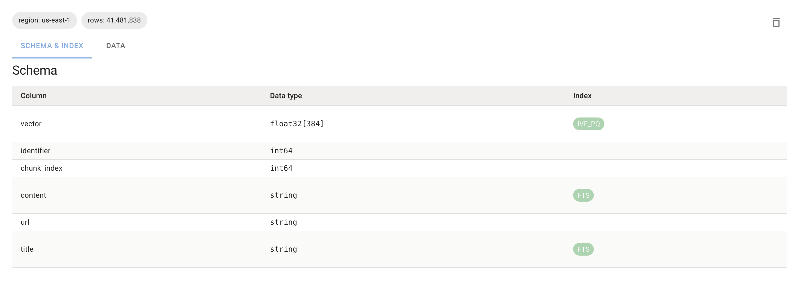

# Introduction

This guide demonstrates the steps required to ingest a large text corpus, like the Wikipedia 41M sample dataset, 
for efficient semantic search and RAG. 
We will cover:

* Connecting to LanceDB
* Defining your data structure
* Adding data in batches
* Creating vector indexes for fast search

To use it yourself, you can visit [this](https://github.com/lancedb/saas-examples-large-scale/tree/main/wikipedia-ingest) repo and follow the instructions.


**Focus:** This document details the crucial **LanceDB setup and operations**. While the full example 
uses Modal for massive parallelization, the LanceDB techniques shown are fundamental and can be applied 
within **any infrastructure** you choose for scaling (Ray, Spark, etc.).


## Performance Metrics

When running this workflow on Modal with 50 GPUs:
* **Ingestion**: Complete 41M records in ~11 minutes
* **Indexing**: Vector index creation in ~30 minutes

You can easily further improve the ingestion speed by using more GPUs, or warming the containers to reduce 
provisioning time. LanceDB can ingest upto data at 4GB/sec. >

By storing Wikipedia chunks and their embeddings in LanceDB, you create a powerful retriever for:
* Semantic search applications
* Retrieval-Augmented Generation (RAG) pipelines
* Knowledge discovery tools

## Prerequisites

Before starting, ensure you have:

1.  **LanceDB python package**
    ```bash
    pip install lancedb
    ```
2.  **Other required Libraries**
    ```bash
    pip install datasets sentence-transformers
    ```
3.  **Dataset:** Access to the Wikipedia dataset.
4.  **Embedding Model:** A Sentence Transformer model.
    ```python
    # Example using Sentence Transformers
    from sentence_transformers import SentenceTransformer
    # Ensure MODEL_NAME is defined (e.g., 'all-MiniLM-L6-v2')
    model = SentenceTransformer(MODEL_NAME)
    VECTOR_DIM = model.get_sentence_embedding_dimension()
    ```

These are the implementation steps.

### 1. Connecting to LanceDB

Establish a connection to your LanceDB database URI. You'll need to create a project on [LanceDB cloud](https://docs.lancedb.com/enterprise/quickstart). You can visit [cloud.lancedb.com](https://cloud.lancedb.com/) to create a 
new project and get the project uri and api key to initialize a connection.

```python
import lancedb

# Connect to lancedb cloud. It requires your project's uri, api_key and region
db = lancedb.connect(
        uri=LANCEDB_URI,
        api_key=LANCEDB_API_KEY,
        region=LANCEDB_REGION
    )
```

### 2. Defining the Data Schema

LanceDB supports both PyArrow and Pydantic for defining schema. Here we'll use Pydantic:

```python
class WikipediaSchema(LanceModel):
    emb: Vector(VECTOR_DIM) # This stores vector embedding
    identifier: int # This is an id for the chunk
    chunk_index: int # This is the chunk number of the context
    content: str # The content of the chunk
    url: str # The link to the article
    title: str # The title of the article
```

* `vector` : Stores the embedding. Ensure list_size matches your VECTOR_DIM.
* `Metadata` : Include fields useful for filtering searches or providing context later.


### 3. Creating (or Opening) the Table

Use `db.create_table` to initialize your table with the defined schema. It's good practice to handle cases 
where the table might already exist in case you're running ingestion operation in distributed fashion.

```python
def get_or_create_table(table_name: str = None):
    """Get an existing table or create a new one if it doesn't exist."""
    db = get_db_connection()
    table_name = table_name or DEFAULT_TABLE_NAME
    
    try:
        return db.open_table(table_name)
    except Exception:
        return db.create_table(table_name, schema=WikipediaSchema)
```

### 4. Adding Data in Batches

Ingest data efficiently using `table.add()`. Prepare data matching the schema (including the computed embedding vector) and add it in reasonably sized batches.
For this we used batches of 200K rows at once.

```python
# Assume 'chunks' is a list of dictionaries like:
# { "content": "...", "identifier": "...", ..., "vector": [0.1, 0.2, ...] }
# The 'add_batch_data' function likely does this:

BATCH_SIZE_LANCEDB = 200_000 

for i in range(0, len(all_processed_chunks), BATCH_SIZE):
    batch_to_add = all_processed_chunks[i : i + BATCH_SIZE]
    try:
        table.add(batch_to_add)
    except Exception as e:
        print(f"Error adding batch to LanceDB: {e}")
```

Batching (table.add(list_of_dicts)) is much faster than adding records individually. Adjust BATCH_SIZE_LANCEDB based on memory and performance.

### 5. Creating a vector index

```python
table.create_index(
    metric="cosine",             # Use "dot" or "cosine"
    vector_column_name="vector", # Must match the schema field name
    index_type="IVF_PQ",      # IVF_PQ balances speed and accuracy well. LanceDB also supports other vector indices
    # Optional tuning parameters below:
    # num_partitions=256,     # Adjust based on dataset size
    # num_sub_vectors=96      # Adjust based on dataset size
)

# Create a full-text search index
table.create_fts_index(["content", "title"])
```
Once the index creation is done, you'll see these labels appear on the columns with index.


To wait until all data is fully indexed, you can specify the wait_timeout parameter on create_index() or call wait_for_index() on the table.

* Indexing is crucial for query performance.

The core pattern is: parallelize data loading, chunking, and embedding generation, then use table.add(batch) 
within each parallel worker to write to LanceDB. LanceDB's design efficiently handles these concurrent additions.
This example uses modal for performing distributed embedding generation and ingestion.

For brevity other common steps like embedding and normalization have not been covered, but you can follow along 
the steps to reproduce on the [github repo](https://github.com/lancedb/saas-examples-large-scale/tree/main/wikipedia-ingest) for a complete implementation including:

* Distributed embedding generation
* Data preprocessing
* Error handling
* Performance optimization